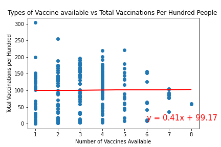
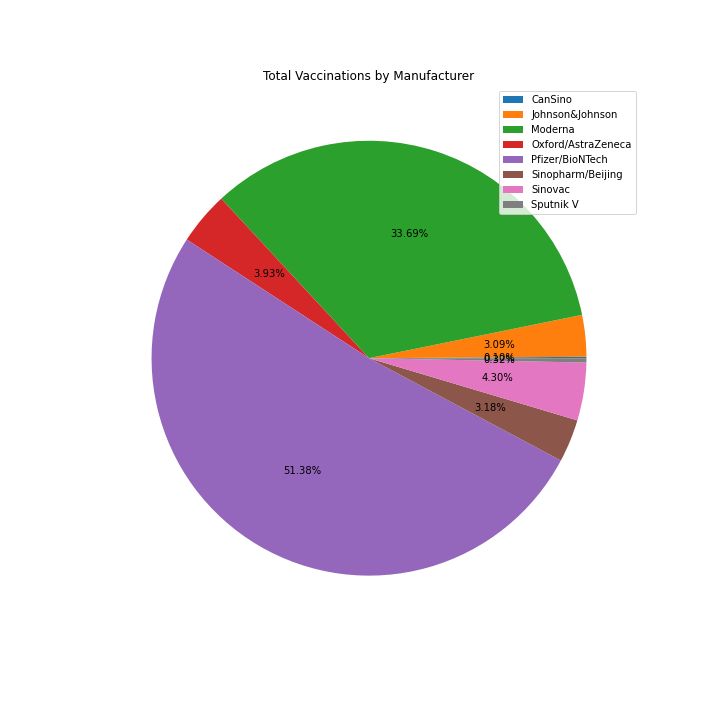
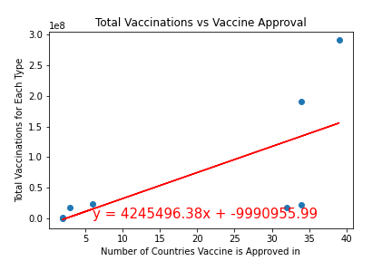

# Monash-Project-1 EDA and Git Collaboration
Project Title:
Global rates of vaccination for COVID-19

Group Members:
Sonam Bhandari, Daniela Cornea, Anita Rynkanen, Matthew Sufra

# Covid 19 Vaccination and Cases Analysis
Investigation of the rates of vaccination around the world and factors that impact these rates.
### Covid 19 Vaccination and Cases Analysis (D. Cornea)

Covid 19 is a disease caused by a virus that easily spreads from person to person and affected people from the whole world since end of 2019. Data about the pandemic is available in different forms and it is updated every day. 

The data source used for this Covid Cases analysis project is owid-covid-data.csv from the ourworldindata.org as well as the country_vaccinations.csv from kaggle.com.

According the the owid-covid-data on 15th December 2021 there were 272,205,417 cases recorded worldwide.

Since the pandemic started, countries like United States, India and Brazil recorded more than 22 million cases each. 

From the data analysed correlation between new cases and new vaccines or people fully vaccinated is very weak.

However, there is a strong positive correlation between the new cases and new deaths demonstrated by a r-squared of 0.71.

Vaccination data shows that the countries with the highest number of people vaccinated are India with 781MIL people vaccinated, United States 234.6MIL and Brazil 163MIL. However, China, India and United States are the countries with the highest number of people fully vaccinated.

The highest number of cases per million of population have been recorded in Montenegro, Seychelles and Andorra.
People fully vaccinated per hundred had the highest rate in Gibraltar 118.19%, United Arab Emirates	89.34% and Chile 83.82%.

Selected countries used as sample for further analysis had more than 100,000 cases and have a GDP higher than 30,000 and a human development index higher than 0.8.
From the selected countries, France and Germany had high number of new cases in around April but the highest number of new cases had been recorded in November.

The vaccination rate varies with Singapore having 87% of population fully vaccinated, Ireland 76% and Australia 75%.

The cases per hundred rate for the selected countries varies from 21% in Slovenia, 14.5% Israel and only 0.8% in Australia.

When analysing the data whithout considering other factors, the results show that in Australia the number of cases increased when the fully vaccinated population increased also. The correlation factor shows a strong positive correlation. However, there are other contextual factors to be considered before drawing a conclusion on the correlation between vaccine and new cases. These factors would include lockdowns, border closure, social distancing, and others.

### GDP, Human Development Index and Life expectancy vs total amount of vaccinations (A. Rynkanen)

When comparing countries and their vaccination rates, differences of their socioeconomic status should be taken into consideration. In this dataset, the total number of vaccinations was compared to GDP per capita, Human Development Index (HDI) and life expectancy. 

When looking at the GDP per capita and the number of total vaccinations, moderate correlation can be observed. Based on the data, Pearson’s correlation coefficient for GDP per capita versus vaccination rate is 0.5. This means that higher GDP indicates higher vaccination rate. 

GDP  gives information about the size of the economy and how an economy is performing.  Higher GDP also gives an indication of how much governments can spend on public services, including health care. As the vaccine supply seems to be the main driver of the vaccination rates , higher vaccination rate requires e.g. good governance and high level of health care as well as the ability to either purchase different vaccines or manufacture them nationally. 

It is to be noted that GDP is not a measure of the overall standard of living. GDP growth does not tell how income is split across a population, and in this context, combined with data on vaccination rate does not alone describe well-being of a country. 

To emphasize other factors than economic growth, the United Nations computes a Human Development Index, which ranks countries based on life expectancy, literacy, and school enrolment. The Human Development Index  is a summary measure of average achievement in key dimensions of human development: a long and healthy life, being knowledgeable and have a decent standard of living. The health dimension is assessed by life expectancy at birth, the education dimension is measured by mean of years of schooling for adults aged 25 years and more and expected years of schooling for children of school entering age. The standard of living dimension is measured by gross national income per capita. 

When looking at the HDI and the number of total vaccinations, no correlation can be observed. Based on the data, Pearson’s correlation coefficient for HDI versus vaccination rate is 0.10. When looking at the life expectancy alone, weak correlation with total number of vaccinations can be observed. In this case, Pearson’s correlation coefficient is 0.31. This relationship, although weak based on this particular dataset, is observed as vaccinations lead to increased life expectancy . Also, generally, wealthier countries have a higher average life expectancy than poorer countries. This can be argued to be achieved through higher standards of living and more effective health care systems.

### Covid 19 Vaccine Manufacturer Analysis (M. Sufra)

As of the 11th of December 2021, there were eight vaccines, manufactured by eight different companies, against covid-19 approved for use by the World Health Organisation.
The data sets used for this project (country_vaccinations.csv from kaggle.com and vaccinations-by-manufacturer from Our World in Data) contains information on six of these vaccines, as well as information on the CanSino vaccine and the Sputnik V vaccine.

In the first data set of 223 countries the average number of vaccines approved for use 3.2 and the most common number of approved vaccines was 4.
The countries with the most vaccines approved for use are Pakistan and Palestine with approval for 8 vaccines, however the upper bound in this data set was calculated to be 7, making these two countries outliers. The next highest approval number is 7, with 8 countries approving this many while the lowest number of approved vaccines is 1 with 36 countries approving a single vaccine.
Plotting the number of vaccines approved in a country against the total number of vaccines administered per hundred people, as of 11th of December 2021 produces a scatter plot that appears to show no obvious correlation.

The line of regression appears almost horizontal and the Pearson's correlation coefficient is close to zero (0.0001) indicating that there is no correlation between number of vaccines approved in a country and the number of vaccinations administered.

The second data records the number of vaccines administered by manufacturer in a selection of 39 countries. It is important to note that this data set does not include China where Sinovac and Sinopharm/Beijing are the most used vaccines and thus may bias the analysis against these two vaccines.
In these 39 countries Pfizer/BioNTech has been the most administered vaccine, accounting for 51.38% of all vaccines administered. Behind Pfizer/BioNTech is Moderna at 33.69% and after that all the other vaccines make up a much small part of vaccines administered in these countries.

Pfizer/BioNTech, Moderna, Oxford/AstraZeneca and Johnson&Johnson are all approved in over 30 of the 39 countries listed in the data set, while CanSino, Sinopharm/Beijing, Sinovac and Sputnik V are all approved in less than 10 of the 39.
When plotting this approval against the total number of vaccines administered from each manufacturer there appears to be a weak positive correlation.

The Pearson's correlation coefficient is 0.44 which indicates a weak to moderate correlation between the number of countries that have approved a vaccine and the number of doses administered. The lack of a stronger correlation may indicate that even though a vaccine may be approved in many countries there is still preference for certain manufacturers over others.

